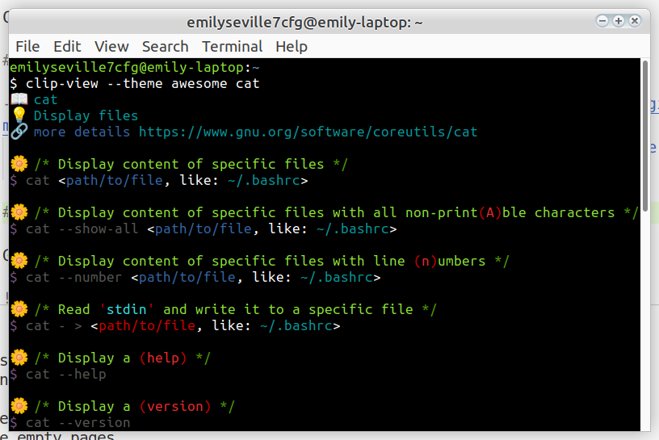
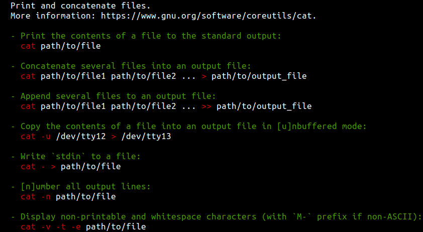

# Command Line Interface (CLI) pages

Command Line Interface (CLI) pages.

## Current goals :checkered_flag:

- Update all coreutils pages to support all [v2.7.0 syntax](https://github.com/command-line-interface-pages/syntax/blob/main/base.md)
  features like availability of `--help`/`--version` options everywhere, switching
  between long/short options

## Quick introduction :rocket:

To get help for `cat` command type `clip-view cat`. If you need a more beautiful
output you can use [this](https://github.com/command-line-interface-pages/themes/tree/main/awesome)
theme like this: `clip-view --theme awesome cat`

Theme is a YAML file itself.

## Similar projects :books:

- [TlDr](https://github.com/tldr-pages/tldr) project with similar goal but with much less expressive syntax.
  Here is a `cat` page in TlDr:

  
