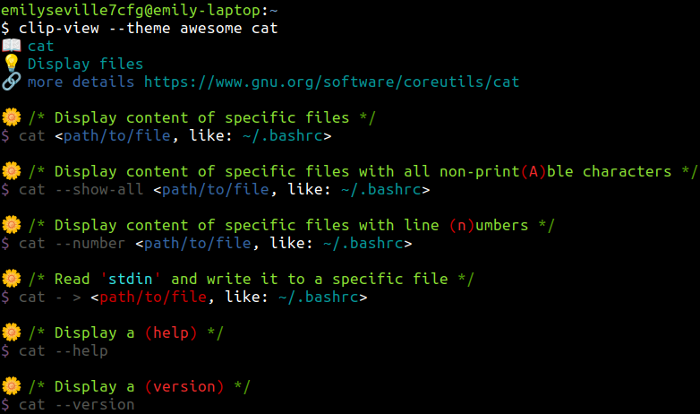

# Command Line Interface (CLI) pages

Command Line Interface (CLI) pages.

## Quick introduction :rocket:

To get help for `cat` command type `clip-view cat`. If you need a more beautiful
output you can use [this](https://github.com/command-line-interface-pages/themes/tree/main/awesome)
theme like this: `clip-view --theme awesome cat`

Theme is a YAML file itself.

## Writing pages :hammer_and_wrench:

Read [this](./CONTRIBUTING.md) guide for details.

## Similar projects :books:

> :bell: Default render settings and official clients are used.

- [TlDr](https://github.com/tldr-pages/tldr) project with similar goal but with
  much less expressive syntax. Here is a `cat` page in TlDr:

  

- [Cheat](https://github.com/cheat/cheat) cheat allows you to create and view
  interactive cheatsheets on the command-line. Here is a `cat` page in Cheat:

  

## Why to use this project :question:

From the page writer's perspective:

- Write less, gain more:
  - Just mention how to get help or a version of some command and get automatically
    generated code examples for these options.
  - Just mention that the command is not intended for direct usage or is deprecated
    and get automatically generated note about it.
- Write using the unambiguous syntax:
  - Define when some command uses some I/O stream and be sure that
    code explanations have just one possible interpretation.
  - Define strict placeholder interpretation and type. Don't guess what some file
    with some extension is, for example, know its meaning directly from code.
- Permit users to use their preferences:
  - Don't use the most appropriate option's style from other's opinions. Let users choose
    what style is the best for them while switching between GNU-style
    long and short options.
- Write in the parsable format:
  - To be able to automatically extract information from pages and be sure about its
    semantics.

From the end-user perspective:

- Know how to get software built-in help or version.
- Be aware of when and what commands to use and what not.
- Know when the command uses and what I/O stream.
- Don't google what some not-familiar file is, see its description right here.
- Be yourself, and not the other person. Chose your code option's style.
